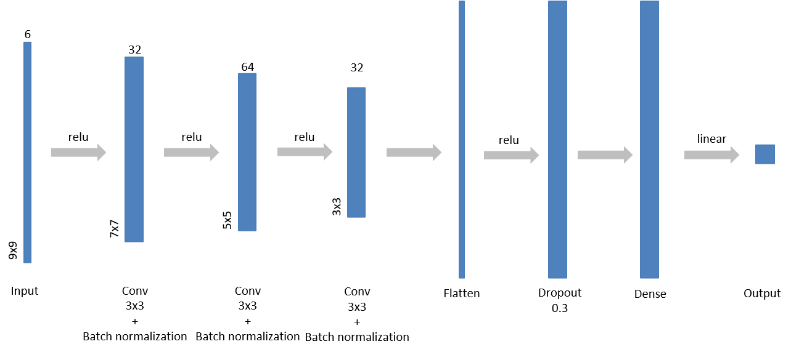

# sdbcnn
Satellite-Derived Bathymetry using Convolutional Neural Networks and Sentinel-2 multispectral images.

&nbsp;

    

&nbsp;

## Dependencies
- [tensorflow-2](https://www.tensorflow.org/)
- [numpy](https://numpy.org/)
- [pandas](https://pandas.pydata.org/)
- [rasterio](https://rasterio.readthedocs.io/en/latest/)
- [matplotlib](https://matplotlib.org/)
- [sklearn](https://scikit-learn.org/stable/)

## Data
- The Sentinel-2 Level-2A images are open and accessible through the [Copernicus Open Access Hub](https://scihub.copernicus.eu/).
- The National Oceanic and Atmospheric Administration (NOAA) Bathymetric Data Viewer provides [MBES](https://maps.ngdc.noaa.gov/viewers/bathymetry/) and [LiDAR](https://coast.noaa.gov/dataviewer/\#/lidar/search/) bathymetry data sets.

Detailed implementation and results can be found in the project report.
