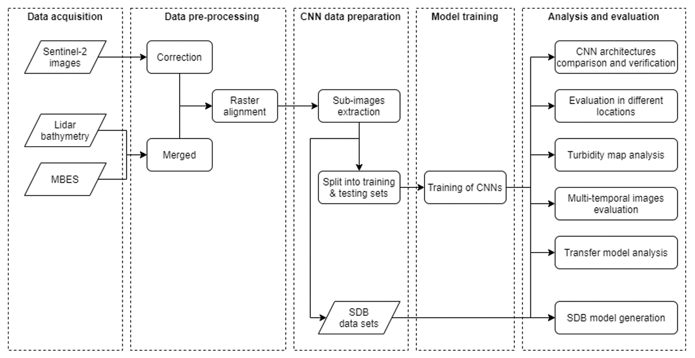

# sdbcnn
Satellite-Derived Bathymetry using Convolutional Neural Networks and Sentinel-2 multispectral images.

Bathymetric depth in shallow water regions is essential for coastal management and research purposes. The measurements using echo sounding or Lidar have high operational costs, require extensive measurement time, and leave data gaps. Satellite-Derived Bathymetry (SDB) becomes an alternative to extract shallow water depths using multispectral imagery. There are two approaches of SDB: analytical and empirical. The analytical method requires several water properties and assumptions. The empirical method relies on the linear relationship between reflectances and in-situ depths, while it may not be entirely linear due to variation in bottom types, water column, and noise. Machine learning approaches have been used to address nonlinearity, but the spatial correlation is still not considered. The spatial correlation also influences SDB computations assuming that adjacent reflectance pixels also have a relationship towards depth. This characteristic of the local connectivity can be detected by Convolutional Neural Networks (CNN). Therefore, this project conducts a study of SDB using the CNN approach.

This study focuses on the following discussion: (i) what kind of preprocessing needed for the data sets; (ii) what kind of CNN architecture can be used; (iii) what is the accuracy of the method; and (iv) to what extent does the pretrained model can be reused. In order to represent a variety of reflectances, this study chooses six areas of interest in three different coastal regions as follows: (i) Ponce, Lajas, and San Juan represent Puerto Rico; (ii) Key west represents the Florida Keys; and (iii) Makua and Honolulu represent Hawaii. These locations have different water conditions regarding the bottom types and turbidity.

    

## Data
Information about the data:
- The Sentinel-2 Level-2A images are open and accessible through the [Copernicus Open Access Hub](https://scihub.copernicus.eu/).
- The National Oceanic and Atmospheric Administration (NOAA) Bathymetric Data Viewer provides [MBES](https://maps.ngdc.noaa.gov/viewers/bathymetry/) and [LiDAR](https://coast.noaa.gov/dataviewer/\#/lidar/search/) bathymetry data sets.

You have to download the multispectral and bathymetric data manually and then perform several preprocessing tasks. The preprocessing can be carried out using [QGIS](https://qgis.org/en/site/), [LAStools](https://rapidlasso.com/lastools/) or [PDAL](https://pdal.io/) if needed. Alternatively, you can use some preprocessing scripts provided under 'preprocess/' to stack the multispectral bands, clip the data, and perform image correction (can be skipped).

This repo provides an example data set, under 'data/', that has been preprocessed.

## A baseline architecture of CNN for SDB

    

## Requirements
- [tensorflow-2](https://www.tensorflow.org/)
- [numpy](https://numpy.org/)
- [pandas](https://pandas.pydata.org/)
- [rasterio](https://rasterio.readthedocs.io/en/latest/)
- [matplotlib](https://matplotlib.org/)
- [sklearn](https://scikit-learn.org/stable/)

## Shallow water depth extraction
### Prepare the data:
python collect_all_data.npy

### Run the training:
python train_val.py

### Run the evaluation:
python test.py
python eval.py

### Run the SDB generator:
python sdb_gen.py

## Results
| Area                  | RMSE  | R2    | 
| :---:                 | :---: | :---: | 
| Ponce, Puerto Rico    | 1.11  | 0.96  |
| Lajas, Puerto Rico    | 1.44  | 0.95  |
| San Juan, Puerto Rico | 2.36  | 0.70  |
| Key West, Florida     | 0.56  | 0.97  |
| Makua, Hawaii         | 0.79  | 0.98  |
| Honolulu, Hawaii      | 1.34  | 0.94  |

More detailed description and results can be found in the [project report].
